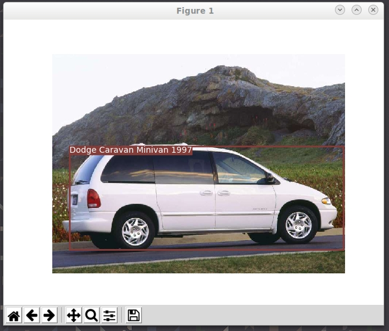

# Computer Vision Challenge

This project fine tunes a pretrained ResNet-152 model for Car Model Recognition.

Code snippets for Car Detection with YOLOv3 has been adopted from this project
(https://github.com/eriklindernoren/PyTorch-YOLOv3.git)

**Download data and model weights**
- Download necessary files
```
bash ./download.sh
```
- Download `best.tar`, the model trained for the project from Google Drive and put under `./model/` directory
```
https://drive.google.com/open?id=1B4NZOXJS2lMjYjloPmY-JGIrTBL5p6Dx
```

**Prepare training data**
- Preprocess the data
    - crop the car images defined by the bouding boxes
    - split them into training/validation datasets with the ratio of 8:2. 
```
python ./load_data.py
```

**To Train**
- Train with ResNet-152 as base model.
```
python ./train.py
```

**To Test**
- Test accuracy on validation dataset
```
python ./train.py --validation
```

**To Predict**
- Run prediction on a single image (cropped car image)
```
python ./predict.py --mode predict --image_path <image_path>
```

- Run detection and prediction on a single image (not cropped) with visualization
```
python ./predict.py --mode predict_and_detect --image_path <image_path>
```

<p align="center"></p>

**TODO**
- Replace ResNet-152 with EfficientNet (https://arxiv.org/abs/1905.11946) (implemented with PyTorch in the project, not trained yet)
